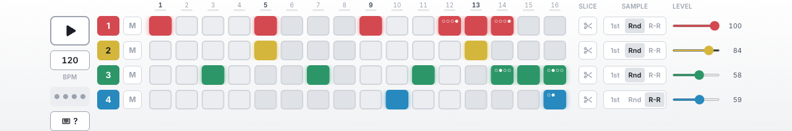

<!-- 
title: 🎛️ Rample Sample Manager
owners: maintainer
last_reviewed: 2026-10-01
tags: documentation
-->

# 🎛️ Rample Sample Manager

[](https://github.com/peteb4ker/romper/actions/workflows/test.yml)
[](https://sonarcloud.io/summary/new_code?id=peteb4ker_romper)
[](https://codecov.io/gh/peteb4ker/romper)
[](https://opensource.org/licenses/MIT)
[](https://github.com/peteb4ker/romper/releases/latest)

**Romper** is a cross-platform desktop application designed to streamline sample kit management for the **Squarp Rample** — a 4-voice Eurorack sampler module. Whether you're a producer working with hundreds of samples or a live performer who needs quick access to perfectly organized kits, Romper provides an intuitive interface for managing, auditioning, and organizing your sample libraries.

## 🎯 What is Romper?

The **Squarp Rample** is a powerful 4-voice sampler in Eurorack format that reads samples from SD cards organized in a specific folder structure. While the Rample itself is excellent, managing large sample libraries, creating kits, and keeping everything organized can become tedious when working directly with files and folders.

**Romper solves this by providing:**
- A **visual interface** for browsing and organizing sample kits
- **Audio preview** with built-in playback and step sequencer
- **Safe sample management** that never modifies your original files
- **Kit editing tools** with drag-and-drop sample assignment
- **Format validation** to ensure compatibility with your Rample hardware

Built with modern web technologies (**Electron**, **React**, **TypeScript**, **Drizzle ORM**), Romper brings the convenience of modern music software to hardware sample management.

## ✨ Key Features

### 🎵 **Intuitive Kit Management**
- Visual browser for all your Rample sample kits with rich metadata
- Organize kits by banks (A-Z) and slots (0-99) matching your hardware
- Quick search and filtering to find the perfect kit instantly
- Mark your most-used kits as favorites

### 🔊 **Audio Preview and Step Sequencer**
- Play samples directly in the app without loading them on hardware, with a waveform for each
- **XOX-style step sequencer**: 16 steps across all 4 voices, 30–180 BPM
- **Trigger conditions** (1:2 through 4:4) make a step fire only on some loops, for patterns up to 64 steps long
- **Sample modes** per voice: always the first sample, random, or round-robin through the voice's layers
- **Slicer**: cut a long sample into Rample-style slices (/8 to /128) and choose a slice for each step. **Roll** randomizes slices, **Lock** keeps the steps you like, and a step can pick a new slice every time it plays
- Per-voice **level** and **mute**; a linked stereo pair plays as one row
- **Undo** for step, condition and slice edits; patterns, conditions and slices are saved with each kit

The sequencer is a preview: it isn't written to the SD card. See the [Step Sequencer manual page](https://peteb4ker.github.io/romper/manual/step-sequencer).



### ✏️ **Powerful Kit Editing**
- Drag-and-drop sample assignment to kit slots
- **Undo/redo support** for safe experimentation
- Format checks when you add a sample, and conversion to a format the Rample plays when you write the card

### 📁 **Reference-Only Architecture**
- **Never modifies your original samples** - works with references only
- Safe to use with existing sample libraries and workflows
- Start from an existing Rample SD card, Squarp's factory samples, or an empty folder
- Your library is the master copy: sync rewrites the card to match it, and never touches the Rample's own saved settings

### 💾 **Hardware Integration**
- Direct SD card synchronization with format validation
- **Squarp Rample naming conventions** automatically applied
- Preview changes before writing to hardware
- Support for multiple SD cards and sample libraries

### 🎛️ **Professional Workflow**
- **Dark/Light theme** support for any studio environment
- Keyboard shortcuts for power users
- **Set up from the official Squarp factory samples**, downloaded and checked during setup

## 👥 Who is Romper for?

### 🎹 **Music Producers**
- Organize hundreds of samples across multiple projects
- Quickly audition and arrange samples into performance-ready kits
- Maintain consistent sample libraries across multiple Rample units

### 🎤 **Live Performers** 
- Create setlist-specific sample kits for different songs or sets
- Quick access to backup kits and emergency sounds
- Reliable, tested sample organization for critical live performances

### 🏠 **Home Studio Musicians**
- Explore and organize the official Squarp factory sample packs
- Learn sample organization techniques for hardware workflow
- Bridge the gap between software DAW samples and hardware performance

### 🔧 **Sample Library Curators**
- Manage large collections of samples from various sources
- Quality control and format validation for professional sample distribution

## 📥 Installation & Quick Start

### Download & Install

1. **Download** the latest release for your operating system:
   - **Windows** (x64): `Romper-x.x.x.Setup.exe`
   - **macOS** (Apple silicon): `Romper.dmg`, or `Romper-darwin-arm64-x.x.x.zip`
   - **Linux** (x64): `romper_x.x.x_amd64.deb`, `romper-x.x.x-1.x86_64.rpm`, or `Romper-linux-x64-x.x.x.zip`

   There's no build for Intel Macs or for ARM Windows and Linux yet. On macOS,
   Romper checks for updates at launch and then weekly; on Windows and Linux,
   download new releases yourself.

2. **Install** and launch Romper

3. The setup wizard asks where your library should start from and where to
   keep it (the **local store**, a folder on your computer)

### First Time Setup

**🎛️ If you have an existing Rample SD card:**
- Insert your SD card and choose **Rample SD Card** in the wizard
- Romper copies the card's kit folders (`A0` to `Z99`) into the local store and imports them
- Start browsing, editing, and organizing immediately

**📁 Starting fresh:**
- Choose **Blank Folder** to create an empty local store
- Create kits and drag your own samples into them

**🏭 Using factory samples:**
- Choose **Squarp.net Factory Samples**: Romper downloads Squarp's sample archive (about 313 MiB), checks it against a known SHA-256, and imports it
- Perfect starting point for new Rample users
- Provides professionally organized examples to learn from
- The wizard runs only when no local store is set up, so choose this when you first set up Romper

## 🏗️ Project Structure

```
romper/
  app/renderer/    # React UI (components, hooks, styles)
  electron/        # Electron main process and preload
  shared/          # Types and Drizzle schema shared by main and renderer
  tests/           # Integration, end-to-end and validation tests; shared mocks and fixtures
  docs/            # Website, user manual, developer docs
```

## 📚 Documentation

### For Users

- **[User Manual](https://peteb4ker.github.io/romper/manual/)** - Getting started, kit browser, kit editor, syncing, keyboard shortcuts
- **[Troubleshooting](docs/troubleshooting.md)**
- **[FAQ](docs/faq.md)**

### For Developers

- **[Contributing](CONTRIBUTING.md)** - Setup, workflow, commit conventions
- **[Product Requirements](docs/developer/product-requirements.md)** - Users, journeys, and requirements
- **[Architecture](docs/developer/architecture.md)** - Process split, IPC, playback pipeline
- **[Coding Guide](docs/developer/coding-guide.md)** - Conventions for TypeScript, components, and tests
- **[Database Schema](docs/developer/romper-db.md)**
- **[Release Process](docs/developer/release-process.md)** and **[Code Signing](docs/developer/code-signing.md)**
- **[CLAUDE.md](CLAUDE.md)** - Instructions for AI coding agents

## ⚙️ Configuration

Romper can be configured using environment variables for advanced use cases:

- **`ROMPER_SDCARD_PATH`** - SD card folder, used instead of the saved one
- **`ROMPER_LOCAL_PATH`** - Local store folder, used instead of the saved one (while it's set, changing the local store in the app has no effect)
- **`ROMPER_SQUARP_ARCHIVE_URL`** - Factory samples archive to use instead of Squarp's (`https://` or `file://`; only Squarp's own archive is checked against its SHA-256)
- **`ROMPER_ENABLE_DEVTOOLS`** - Set to `1` to expose Reload / Toggle Developer Tools in the View menu of a packaged build (off by default; intended for diagnosing issues in installed releases)

## 🛠️ Development

### Prerequisites

- **Node.js** 22.12 or later, with npm (`.nvmrc` pins 22, and CI uses it)
- **Git** for version control  
- **Squarp Rample** (optional, for testing with real hardware)

### Development Commands

```bash
# Start development (builds + hot reload)
npm run dev

# Testing
npm run test:fast   # Unit + integration (~1 min)
npm run test        # Same, with merged coverage
npm run test:e2e    # End-to-end tests (hidden window)
npm run test:e2e:headed  # Same, with the app window visible

# Quality checks
npm run lint        # ESLint + auto-fix
npm run typecheck   # TypeScript validation

# Production build
npm run build       # Build all components
npm run make        # Create distributables
```

### Contributing

See [CONTRIBUTING.md](CONTRIBUTING.md).

## 📄 License & Privacy

- **License:** [MIT License](LICENSE) — feel free to fork and contribute!
- **Privacy:** [Privacy Policy](PRIVACY.md) — We collect NO user data. Romper goes online only to download the factory samples when you ask, and on macOS to check for updates
