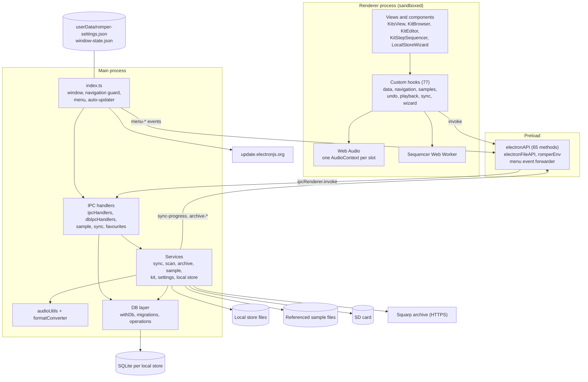
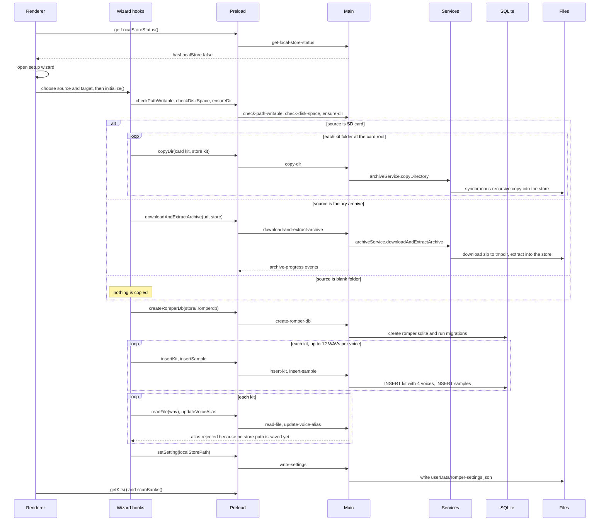
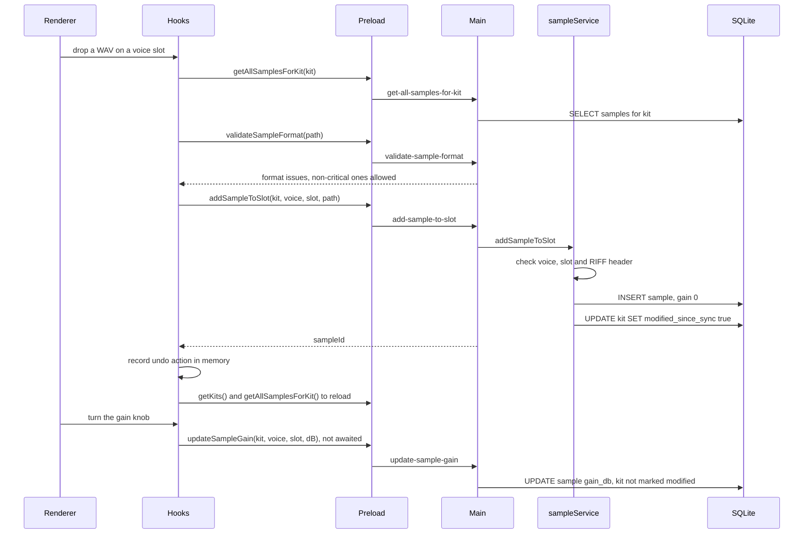
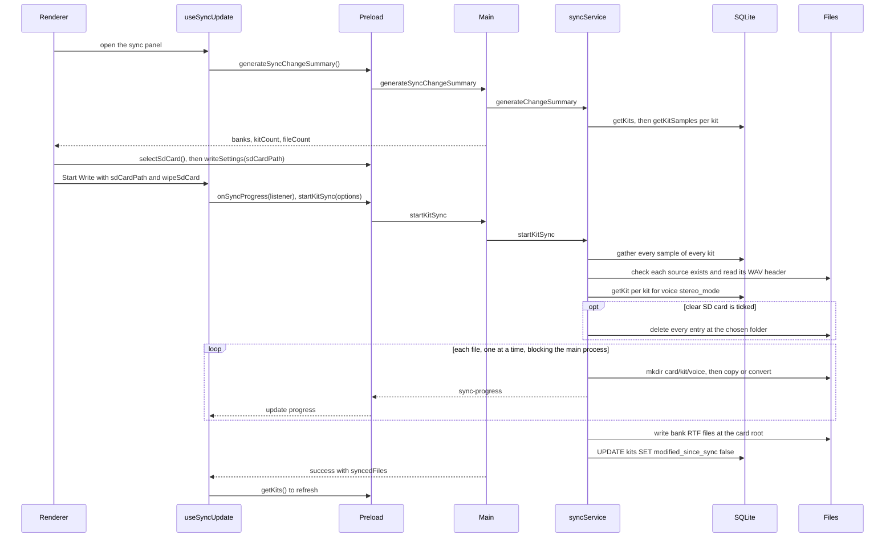

# System Architecture

> Reverse-engineered from `main` @ `87bea51` (app version 1.3.1) on 2026-09-29.

## System Overview

Romper is an Electron desktop app with the standard three layers:

1. **Main process** (`electron/main/`, Node 22 inside Electron 39): window
   and menu, 62 IPC handlers, the service layer (sync, scan, archive,
   samples, kits, settings), SQLite access through Drizzle, WAV format
   conversion.
2. **Preload bridge** (`electron/preload/index.ts`): exposes a typed
   `electronAPI` object through `contextBridge`. It is the only way the
   renderer reaches Node or the file system.
3. **Renderer** (`app/renderer/`, React 19): the kit browser, kit editor,
   step sequencer and setup wizard. Most business logic lives in 77 custom
   hooks. The renderer is sandboxed (`sandbox: true`,
   `contextIsolation: true`, `nodeIntegration: false`).

There is no server. Each **local store** folder holds its own SQLite
database (`.romperdb/romper.sqlite`), and the app writes kits to the SD
card on demand. The database is the source of truth; the renderer
re-fetches after most writes instead of keeping a client-side store.

## Architecture Diagram



## Component Descriptions

### Main process entry (`electron/main/index.ts`)
- **Purpose**: Start the app.
- **Responsibilities**: Create the window with sandboxing and navigation
  hardening; load the dev URL or the built `index.html`; load settings and
  validate the saved local store; register IPC handlers; build the menu;
  start the macOS auto-updater; log unhandled rejections.
- **Dependencies**: `mainProcessSetup`, the IPC handler files,
  `applicationMenu`, `autoUpdater`, `logger`.
- **Type**: Application.

### IPC handlers (`electron/main/*IpcHandlers.ts`, `db/*IpcHandlers.ts`)
- **Purpose**: The server side of the bridge.
- **Responsibilities**: Map 62 channels to services and DB operations.
  `createDbHandler` resolves the database folder. Input validation is
  mostly absent (see code-quality-assessment.md).
- **Dependencies**: services, DB layer.
- **Type**: Application.

### Services (`electron/main/services/`)
- **Purpose**: Business operations.
- **Responsibilities**: Sync to the SD card (gather, classify, convert,
  write, RTFs, progress, cancel flag); kit rescan and bank scan; archive
  download and extraction; sample add / replace / delete / move with
  validation; kit create / copy / delete; settings; local store status and
  validation.
- **Dependencies**: DB layer, `audioUtils`, `formatConverter`,
  `archiveUtils`, `node:fs`.
- **Type**: Application.

### DB layer (`electron/main/db/`)
- **Purpose**: Persistence.
- **Responsibilities**: Open a better-sqlite3 connection per call
  (`withDb`), with WAL, `busy_timeout=5000` and `synchronous=NORMAL`.
  Foreign keys are off on purpose. Run migrations lazily once per database
  per session. Provide CRUD for banks, kits, voices and samples.
  `withDbTransaction` (`BEGIN IMMEDIATE`) is used by `copyKit`, `deleteKit`
  and sample moves only.
- **Dependencies**: better-sqlite3, drizzle-orm, `shared/db/schema.ts`.
- **Type**: Infrastructure.

### Preload bridge (`electron/preload/index.ts`)
- **Purpose**: The security boundary.
- **Responsibilities**: Expose `electronAPI` (checked against
  `shared/electronApi.ts` with `satisfies`), `electronFileAPI` (path of a
  dropped file) and `romperEnv`; forward `menu-*` IPC events as DOM
  events; hide `ipcRenderer` from the page.
- **Dependencies**: `shared/electronApi.ts`, `shared/db/types.ts`.
- **Type**: Client.

### Renderer views and components (`app/renderer/`)
- **Purpose**: The UI.
- **Responsibilities**: `KitsView` orchestrates everything and switches
  between the browser and the editor based on state (not the route). The
  kit grid is virtualised with react-window. There is no React error
  boundary.
- **Dependencies**: hooks, `SettingsContext`, `MessageDisplayContext`.
- **Type**: Application.

### Renderer hooks (`app/renderer/components/hooks/`)
- **Purpose**: Business logic in the UI.
- **Responsibilities**: Kit data and refresh (`useKitDataManager`),
  navigation, search and filters, sample operations and undo, playback and
  the voice choke (`useKitPlayback`), the step sequencer
  (`useKitStepSequencerLogic`, a Blob Web Worker clock), sync
  (`useSyncUpdate`), and the setup wizard.
- **Dependencies**: `globalThis.electronAPI`, shared types.
- **Type**: Application.

### Shared (`shared/`)
- **Purpose**: Code used by more than one layer.
- **Responsibilities**: Drizzle schema and types, the bridge contract,
  kit-name utilities, error utilities, undo types.
- **Dependencies**: drizzle-orm.
- **Type**: Model.

## Data Flow

Most requests follow one path:

```
User action -> component -> hook -> globalThis.electronAPI.X()
  -> preload ipcRenderer.invoke("channel") -> ipcMain.handle
  -> service or DB operation -> SQLite / file system
  -> DbResult back to the hook -> state update, often a full getKits() reload
```

### First-run setup (import from an SD card or the factory archive)



### Editing a kit



### Writing kits to the SD card



## Integration Points

- **External APIs**:
  - `https://data.squarp.net/RampleSamplesV1-2.zip` - factory sample
    archive downloaded by the setup wizard. Overridable with
    `ROMPER_SQUARP_ARCHIVE_URL`. No checksum is verified.
  - `update.electronjs.org` (backed by GitHub Releases) - macOS
    auto-update, weekly check, packaged builds only. Currently broken by
    the main-process bundling (see code-quality-assessment.md).
  - `shell.openExternal` - opens https links (manuals) in the browser.
- **Databases**: one SQLite file per local store,
  `<store>/.romperdb/romper.sqlite` (plus `-wal` and `-shm`). Twelve
  migrations are bundled into the app and applied lazily.
- **Local files**:
  - `userData/romper-settings.json` - settings. Only `localStorePath` and
    `sdCardPath` survive a restart; other keys are dropped on load.
  - `userData/window-state.json` - window bounds.
  - The local store folder, referenced sample files anywhere on disk, and
    the SD card.
- **Third-party services (CI only)**: SonarCloud, Codecov, Apple notary
  service, Azure Trusted Signing (inactive), GitHub Pages.

## Infrastructure Components

- **Deployment model**: installers published to GitHub Releases by
  `.github/workflows/release.yml` on a `v*` tag.
  1. **Quality gate**: queries the SonarCloud API for open critical or
     blocker issues and unreviewed hotspots. It runs no tests, and it
     passes when the API returns nothing.
  2. **Build** on ubuntu, macos and windows runners (Node 22).
     - macOS (arm64 only): Forge packages an unsigned `.app`; rcodesign
       signs it with per-helper entitlements from
       `electron/resources/rcodesign.toml`, notarises and staples it; Forge
       wraps it in a DMG and zip; the DMG is signed, notarised and stapled.
     - Linux (x64): deb, rpm, zip.
     - Windows (x64): Squirrel installer. Azure Trusted Signing runs only if
       `AZURE_CLIENT_ID` is set; it is empty, so v1.3.1 shipped unsigned.
  3. **Release** (tag pushes only): generates release notes and publishes
     with `ncipollo/release-action`. Tags with a hyphen are prereleases.
- **Packaging**: Electron Forge with Fuses (RunAsNode, NODE_OPTIONS and CLI
  inspect disabled). No asar archive, and every `dependencies` package is
  copied into the app.
- **Networking**: none of its own. The app makes outbound HTTPS requests
  only for the factory archive and auto-update.

## Security Architecture

**In place**
- Sandboxed renderer: `sandbox: true`, `contextIsolation: true`,
  `nodeIntegration: false`. The preload never exposes `ipcRenderer`.
- Pop-ups are denied; http(s) links open in the external browser.
- `open-external` accepts https only.
- Hardened production CSP (`script-src 'self' blob:`, no `unsafe-eval`,
  `connect-src 'self'`, `object-src 'none'`).
- Archive extraction blocks Zip-Slip and caps entry count, per-file size
  and total size.
- `read-file` refuses symlinks, non-regular files and files over 256 MiB.
- `cleanup-partial-init` can only delete a `.romperdb` directory.
- All SQL goes through Drizzle parameterised queries.
- DevTools are hidden in packaged builds unless `ROMPER_ENABLE_DEVTOOLS=1`.

**Gaps** (details and fixes in code-quality-assessment.md)
- The `will-navigate` guard compares URL origins, and every `file://` URL
  has origin `"null"`. In packaged builds any local file therefore passes
  as same-origin and keeps the full bridge.
- Many channels accept arbitrary paths from the renderer: file read,
  directory listing, directory create and copy, archive extraction into any
  folder, database create and insert in any folder. There is no sender
  check and no scoping to the local store.
- The SD-card wipe deletes everything at whatever folder is chosen.
- No session permission handler, so Electron's default approves requests.
- Electron 39 is out of support and has four High advisories.
