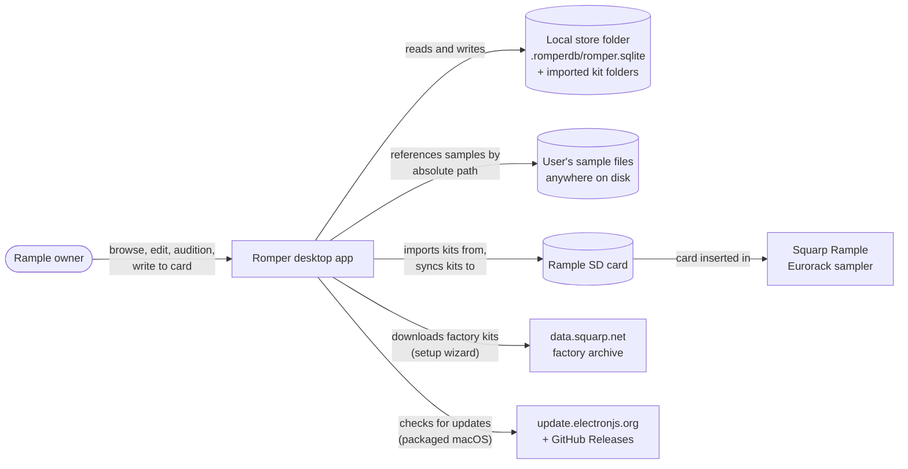

# Business Overview

> **Dated snapshot, not maintained.** This file describes `main` at commit
> `87bea51` (2026-09-29) and hasn't been kept up to date since. For current
> behaviour read the code on `main`; for what's still open, see
> [GitHub issues](https://github.com/peteb4ker/romper/issues).

> Reverse-engineered from `main` @ `87bea51` (app version 1.3.1) on 2026-09-29.

## Business Context Diagram

## Business Description

- **Business Description**: Romper is a cross-platform desktop app that
  manages sample kits for the Squarp Rample, a four-voice Eurorack sampler
  that plays kits from an SD card. The card needs a strict layout: banks
  A to Z, kits 0 to 99 in each bank, 4 voices per kit, and up to 12 sample
  layers per voice. Romper replaces hand-managing those folders and files
  with a visual kit browser, drag-and-drop kit editing, in-app auditioning
  (per-sample playback and a 4 x 16 step sequencer), and a one-button
  "write kits to SD card" sync.

  Romper keeps a **local store**: a folder the user picks, holding a SQLite
  database and any kit folders imported from a card or the factory archive.
  The store is the working copy; the SD card is the output target. Samples
  the user adds later are referenced by absolute path and are only copied
  (and converted if needed) when the kits are written to the card.

  Kit data falls into two groups:
  - **Written to the card**: which WAV sits in which voice and slot,
    per-sample gain (applied to the audio at sync), mono/stereo per voice,
    and bank artist names (RTF files at the card root).
  - **Preview only, never written**: BPM, step pattern, trigger conditions,
    voice volume and sample mode.

- **Business Transactions**:

  | ID | Transaction | Description |
  |---|---|---|
  | T1 | First-run setup | A wizard creates the local store from an SD card (copies kit folders), the Squarp factory archive (downloads and extracts about 313 MiB), or a blank folder. It creates the database, catalogues up to 12 WAVs per voice, and tries to infer voice names. An existing store can be chosen instead. |
  | T2 | Browse and find kits | Virtualised grid grouped by bank, with an A to Z bank sidebar. Client-side search over kit name, alias, bank artist, sample file names and voice names. Favourites and "modified since sync" filters. |
  | T3 | Create, duplicate and delete kits | Create an empty kit in a free slot, duplicate a kit to another slot, delete a kit (blocked if `locked`, though nothing sets that flag). |
  | T4 | Edit a kit | Drag WAVs onto voice slots; replace, move (within or across kits) and delete samples; link voices as stereo pairs; set per-sample gain; name voices; toggle the kit's editable flag. Imported kits start read-only ("Factory kit"). |
  | T5 | Audition | Play any sample with a per-voice choke (a new trigger on a voice stops the previous sample on that voice). Program a 4 x 16 pattern with velocities, A:B trigger conditions and sample modes (first, random, round-robin), and play it at a BPM. |
  | T6 | Undo and redo | In-memory undo for sample add, delete, move and replace (Cmd/Ctrl+Z, Cmd/Ctrl+Shift+Z or Ctrl+Y). Gain, BPM, pattern and stereo changes are not undoable. |
  | T7 | Write kits to the SD card | Shows kit and file counts, then copies every sample of every kit to `<card>/<kit>/<voice>/<file>`, converting to 16-bit / 44.1 kHz (and mono where needed) when the format or gain requires it. Writes bank RTF files and clears the "modified" flags. Optional "clear SD card first" deletes everything at the chosen folder. |
  | T8 | Rescan | "Scan Kit" and "File > Scan All" rebuild a kit's sample rows from the WAVs in its store folder, and read WAV metadata. Bank names are re-read from RTF files at startup. |
  | T9 | Name banks | Edit a bank's artist name; Romper writes an empty `{L} - {Artist}.rtf` file in the store root and, at sync, on the card. |
  | T10 | Manage settings and the local store | Theme, "confirm destructive actions", change or re-select the local store, remember the SD card path. |

- **Business Dictionary**:

  | Term | Meaning | Where it lives |
  |---|---|---|
  | Bank | A letter A to Z grouping up to 100 kits (slots 0 to 99), with an optional artist name | `banks` table |
  | Bank name (RTF) | An empty RTF file named `{L} - {Artist}.rtf` at the store root and card root; the Rample reads bank names from these | `rtfFileService.ts` |
  | Kit | One Rample kit slot, named `A0` to `Z99` | `kits.name` (primary key) |
  | Kit alias | Optional human-readable kit name | `kits.alias` |
  | Voice | One of the 4 channels in a kit | `voices` table |
  | Voice name | User-set or inferred label for a voice | `voices.voice_alias` |
  | Slot | Position 0 to 11 in a voice (shown as 1 to 12) | `samples.slot_number` |
  | Sample | A WAV file assigned to a voice slot, stored as an absolute path | `samples` table, `source_path` |
  | Stereo linking | Voice N plays stereo and takes over voice N+1 | `voices.stereo_mode` on the primary voice |
  | Gain | Per-sample trim, -24 to +12 dB, applied to the audio at sync and in preview | `samples.gain_db` |
  | Voice volume | Preview-only level, 0 to 100 | `voices.voice_volume` |
  | Sample mode | Preview-only choice of which layer the sequencer plays: first, random, round-robin | `voices.sample_mode` |
  | BPM | Preview tempo, 30 to 180 | `kits.bpm` |
  | Step pattern | 4 x 16 grid of velocities (0 means off) | `kits.step_pattern` |
  | Trigger condition | `"A:B"` on a step: fires on cycle A of every B cycles | `kits.trigger_conditions` |
  | Voice choke | Playing a sample on a voice stops that voice's other playing samples | `useKitPlayback.ts` |
  | Editable | Whether a kit accepts drops and edits; imported kits start as not editable | `kits.editable` |
  | Locked | Delete guard; no UI sets it | `kits.locked` |
  | Modified since sync | Set by sample add, delete and move; cleared by sync; drives the "Modified" filter | `kits.modified_since_sync` |
  | Favourite | Bookmark flag | `kits.is_favorite` |
  | Local store | The folder holding `.romperdb/romper.sqlite` and imported kit folders | setting `localStorePath` |
  | SD card | Sync target and possible import source | setting `sdCardPath` |
  | Factory archive | Squarp's official sample pack, downloaded by the wizard | `config.ts` |
  | Sync | Writing all kits to the SD card | `syncService.ts` |
  | Wipe | "Clear SD card before writing": deletes every entry at the chosen card folder | `syncService.ts:287-315` |
  | Scan | Rebuilding a kit's sample rows from its folder, or reading bank RTFs | `scanService.ts` |

## Component Level Business Descriptions

### Kit browser (renderer)
- **Purpose**: Let the user see and find kits the way the Rample organises
  them.
- **Responsibilities**: Bank-grouped grid; bank navigation; search;
  favourites and modified filters; kit create, duplicate and delete;
  bank naming; starting a sync.

### Kit editor and voice panels (renderer)
- **Purpose**: Build a kit.
- **Responsibilities**: Show four voices and their 12 slots; accept
  dropped WAVs and check them against the Rample format; replace, move and
  delete samples; stereo linking; gain; voice names; editable toggle;
  undo and redo.

### Step sequencer and playback (renderer)
- **Purpose**: Audition a kit without the hardware.
- **Responsibilities**: Per-sample playback with the voice-choke rule;
  waveform display; a 4 x 16 pattern with trigger conditions, sample modes
  and BPM. Preview plays the original files, without the mono or format
  conversion that sync applies, so it can differ from what the Rample plays.

### Setup wizard and settings (renderer + main)
- **Purpose**: Get a user from nothing to a working local store, and keep
  settings.
- **Responsibilities**: Import from an SD card, the factory archive or a
  blank folder; pre-checks (writable, disk space); database creation;
  voice-name inference; choosing an existing store; theme and preferences.

### Sync service (main)
- **Purpose**: Produce a Rample-ready SD card.
- **Responsibilities**: Gather every sample, decide copy versus convert,
  optionally wipe the card, write files and bank RTFs, report progress,
  mark kits synced. It does not detect changes, remove stale files from the
  card, or take a backup.

### Scan service (main)
- **Purpose**: Bring the database in line with files on disk.
- **Responsibilities**: Rebuild a kit's sample rows from its folder, read
  WAV metadata, read bank names from RTF files. The rebuild discards
  in-app edits for that kit.

### Database layer (main)
- **Purpose**: Hold the catalogue: banks, kits, voices, samples, and the
  preview-only kit data.
- **Responsibilities**: CRUD, migrations, favourites, the modified flag.

### Release pipeline (CI)
- **Purpose**: Deliver installers to users.
- **Responsibilities**: Build for macOS (arm64), Windows (x64) and Linux
  (x64); sign and notarise the macOS app; publish to GitHub Releases, which
  also feeds macOS auto-update.
