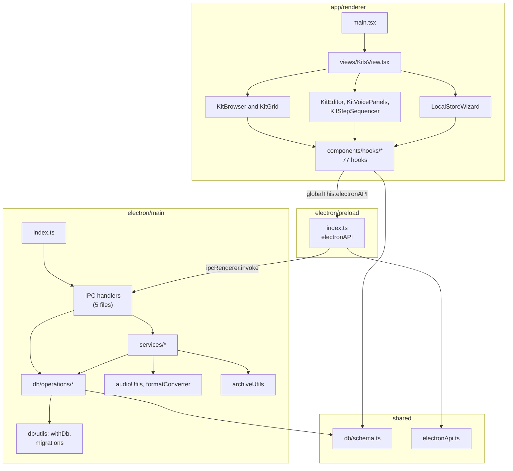

# Code Structure

> **Dated snapshot, not maintained.** This file describes `main` at commit
> `87bea51` (2026-09-29) and hasn't been kept up to date since. For current
> behaviour read the code on `main`; for what's still open, see
> [GitHub issues](https://github.com/peteb4ker/romper/issues).

> Reverse-engineered from `main` @ `87bea51` (app version 1.3.1) on 2026-09-29.

## Build System

- **Type**: npm + Vite 8 (Rolldown) + tsc + Electron Forge 7.
- **`npm run build`** runs three builds in parallel:
  - `build:main` - `vite build --config vite.main.config.ts`. Builds
    `electron/main/index.ts` as an ES library into `dist/electron/main/`,
    keeps `better-sqlite3` and `unzipper` external, and copies the SQL
    migrations and menu icons.
  - `build:preload` - `tsc -p electron/preload/tsconfig.preload.json`,
    then renames the output to `dist/electron/preload/index.cjs`.
    (`vite.preload.config.ts` exists but is not used.)
  - `build:renderer` - `vite build --config vite.config.ts` into
    `dist/renderer/`. A plugin swaps the development CSP for a hardened
    production CSP.
- **`npm run dev`** (`scripts/dev.js`) reads per-worktree ports from
  `.env.local`, builds, then runs the Vite dev server and Electron together.
  In dev, Electron loads the renderer from `http://localhost:<port>`. In
  production it uses `loadFile(dist/renderer/index.html)`.
- **`npm run make`** packages with Forge. Signing is done afterwards in
  `release.yml` (see architecture.md).
- **`postinstall`** rebuilds `better-sqlite3` for Electron's Node ABI.
- **Type-checking**: `npm run typecheck` (`tsc --noEmit`) covers
  `app`, `electron` and `shared`, excluding `__tests__` and the preload.
  `tests/` and co-located tests are never type-checked.

## Key Modules

### Existing Files Inventory

The renderer's components and hooks are listed individually in
component-inventory.md. The main process, preload and shared files are
listed here.

**Main process: bootstrap**
- `electron/main/index.ts` - Entry point. Creates the window
  (`contextIsolation`, `sandbox`, no Node integration), applies navigation
  hardening, loads the renderer, loads and validates settings, registers
  62 IPC handlers, builds the menu, starts the auto-updater.
- `electron/main/mainProcessSetup.ts` - Reads `romper-settings.json` and
  `window-state.json`; at startup validates the saved local store and
  erases the path if it is invalid. Keeps only `localStorePath` and
  `sdCardPath`.
- `electron/main/applicationMenu.ts` - Native menu. Sends `menu-*` events.
  DevTools entries only when unpackaged or `ROMPER_ENABLE_DEVTOOLS=1`.
- `electron/main/menuIcons.ts` - macOS template menu icons.
- `electron/main/autoUpdater.ts` - `update-electron-app`, packaged macOS
  only, weekly check.
- `electron/main/utils/logger.ts` - `console.log` wrapper gated on
  `NODE_ENV` or `ROMPER_DEBUG`.
- `electron/main/types/settings.ts` - `InMemorySettings` type.

**Main process: IPC handlers**
- `electron/main/ipcHandlers.ts` - Settings, store status, dialogs, shell,
  kit create / copy / delete, file read and listing, archive download,
  directory helpers, disk space, writable check, partial-init cleanup.
- `electron/main/dbIpcHandlers.ts` - DB creation and inserts, kit / voice /
  gain / BPM / pattern updates, validation, rescan, bank scan and update,
  audio metadata.
- `electron/main/db/sampleIpcHandlers.ts` - Sample add, replace, delete,
  move, source validation.
- `electron/main/db/syncIpcHandlers.ts` - Sync summary, start, cancel.
- `electron/main/db/favoritesIpcHandlers.ts` - Favourites.
- `electron/main/db/ipcHandlerUtils.ts` - `createDbHandler`,
  `createSampleOperationHandler`, DB-folder resolution.

**Main process: database**
- `electron/main/db/romperDbCoreORM.ts` - Re-exports every DB operation.
- `electron/main/db/utils/dbUtilities.ts` - `openDatabase` (WAL,
  `busy_timeout=5000`, `synchronous=NORMAL`, foreign keys off),
  `createRomperDbFile`, `validateDatabaseSchema`, `withDb`,
  `withDbTransaction` (`BEGIN IMMEDIATE`).
- `electron/main/db/utils/dbMigrations.ts` - Finds the migrations folder,
  runs migrations lazily once per DB per session, repairs the 0008/0009
  migration history.
- `electron/main/db/operations/kitCrudOperations.ts` - Kit CRUD
  (`copyKit` and `deleteKit` use transactions).
- `electron/main/db/operations/kitRelationalHelpers.ts` - Batch loads
  banks, voices and samples and joins them in memory.
- `electron/main/db/operations/kitFavoritesOperations.ts` - Favourites.
- `electron/main/db/operations/kitSyncOperations.ts` -
  `modified_since_sync` flag.
- `electron/main/db/operations/sampleCrudOperations.ts` - Sample rows,
  delete with reindexing, gain, metadata.
- `electron/main/db/operations/sampleManagementOps.ts` - Move wrapper and
  slot reindexing.
- `electron/main/db/operations/sampleMovement.ts` - Insert-only move in
  one transaction.
- `electron/main/db/operations/voiceCrudOperations.ts` - Voice alias,
  sample mode, stereo mode, volume.
- `electron/main/db/operations/crudOperations.ts` - Re-exports plus bank
  reads and updates.
- `electron/main/db/migrations/` - 12 SQL files (0000 to 0011; 0008 is
  missing and there are two 0009 files), 11 snapshots, journal.
- `electron/main/db/fileOperations.ts`, `db/stepPatternUtils.ts` - Dead.

**Main process: services**
- `services/settingsService.ts` - Reads settings with env overrides;
  writes one key by rewriting the whole file.
- `services/localStoreService.ts` - Store status; hardened `readFile`;
  directory listing; store validation entry points.
- `localStoreValidator.ts` - File-system checks, schema check, DB-versus-
  disk comparison.
- `services/archiveService.ts` - Download (or `file://`) then extract;
  synchronous recursive directory copy; `ensureDirectory`.
- `archiveUtils.ts` - HTTPS download; streaming unzip with Zip-Slip and
  decompression-bomb limits.
- `services/kitService.ts` - Kit create / copy / delete with name and lock
  checks.
- `services/sampleService.ts` - Front door for sample operations.
- `services/crud/sampleCrudService.ts` - Add sample; cross-kit move.
- `services/sampleBatchOperations.ts` - Deletes; cross-kit move with
  manual rollback; in-kit move.
- `services/sampleValidation.ts`, `services/validation/sampleValidator.ts`
  - RIFF/WAVE check, voice/slot ranges, stereo conflicts, source checks.
- `services/metadata/sampleMetadataService.ts` - Reads a whole sample
  file for playback.
- `services/slot/sampleSlotService.ts` - Slot helpers (unused in
  production).
- `services/scanService.ts` - Kit rescan (rebuilds sample rows from disk)
  and bank RTF scan.
- `services/syncService.ts` - Sync orchestration: summary, run, wipe, RTF
  files, mark kits synced.
- `services/syncSampleProcessing.ts` - Gathers samples and builds each
  destination path.
- `services/syncFileOperations.ts` - Chooses copy or convert; processes
  files one by one.
- `services/syncValidationService.ts` - Error categories; source and
  format checks.
- `services/syncMonoAnnotation.ts` - Flags stereo samples on mono voices
  for mono conversion.
- `services/syncProgressManager.ts` - Sync job state, cancel flag,
  `sync-progress` events.
- `services/rtfFileService.ts` - Writes and removes `{L} - {Artist}.rtf`.
- `services/stereoSyncProcessor.ts`, `services/rampleNamingService.ts` -
  Dead alternative sync planner and naming service.
- `audioUtils.ts` - Rample format rules (8/16-bit, 44.1 kHz, up to 2
  channels, `.wav`) and a WAV header parser.
- `formatConverter.ts` - Decode, mono, gain, linear resample, 16-bit
  encode.
- `wavHeader.ts`, `wavCodec.ts` - RIFF chunk walker; PCM and float sample
  decode and integer PCM encode (replaced node-wav, RE-62).
- `utils/fileSystemUtils.ts` - Path helper, disk space (`statfsSync`),
  writable probe, `.romperdb`-only delete.
- `utils/errorCategorizationUtils.ts`, `utils/stereoProcessingUtils.ts` -
  Dead.

**Preload**
- `electron/preload/index.ts` - The bridge: 65 `electronAPI` methods,
  `electronFileAPI`, `romperEnv`, a settings helper and the menu event
  forwarder. Includes 65 dev-only debug log statements.

**Shared**
- `shared/electronApi.ts` - Bridge contract.
- `shared/db/schema.ts` - Drizzle schema, relations, types, `DbResult`.
- `shared/db/types.ts`, `shared/db/index.ts` - Re-exports (`index.ts` is
  unused).
- `shared/audioTypes.ts` - Audio metadata types.
- `shared/errorUtils.ts` - Error classes and helpers.
- `shared/kitUtilsShared.ts` - Kit-slot parsing and sorting, voice
  inference.
- `shared/slotUtils.ts` - Slot limits and conversion (renderer only).
- `shared/undoTypes.ts` - Undo action types (renderer only).

**Renderer top level** (details in component-inventory.md)
- `app/renderer/main.tsx`, `views/`, `components/` (components plus
  `hooks/`, `dialogs/`, `preferences/`, `wizard/`, `led-icon/`, `icons/`,
  `shared/`, `utils/`), `utils/`, `styles/index.css`, `config.ts`,
  `electron.d.ts`.

## Design Patterns

### Natural keys matching the hardware
- **Location**: `shared/db/schema.ts`
- **Purpose**: kits are keyed by their Rample name (`A0` to `Z99`) and
  banks by letter, so the DB maps directly onto the card layout.
- **Implementation**: text primary keys; voices and samples store
  `kit_name` and an explicit `voice_number`.

### DbResult envelope
- **Location**: `shared/db/schema.ts:100-104`, all DB operations and most
  handlers.
- **Purpose**: return errors as data across IPC.
- **Implementation**: `{ success, data?, error? }`. Not used consistently:
  some handlers throw instead.

### Handler wrappers
- **Location**: `electron/main/db/ipcHandlerUtils.ts`
- **Purpose**: resolve the DB folder and standardise errors.
- **Implementation**: `createDbHandler` and `createSampleOperationHandler`.
  They do not validate inputs or catch every exception.

### Connection per operation
- **Location**: `electron/main/db/utils/dbUtilities.ts:157-184`
- **Purpose**: keep DB access simple and stateless.
- **Implementation**: `withDb` opens a new better-sqlite3 connection for
  each call, runs pending migrations once per session, and closes it.
  Only three operations use `withDbTransaction`.

### Hook composition with render-function hooks
- **Location**: `app/renderer/components/hooks/`
- **Purpose**: keep business logic out of components.
- **Implementation**: composer hooks (`useKitEditorLogic`,
  `useKitBrowser`, `useSampleManagement`) combine focused hooks. The
  voice-panel hooks return JSX render functions nested five layers deep.

### Database as source of truth, re-fetch after writes
- **Location**: `useKitDataManager`, `useKitEditorLogic`
- **Purpose**: avoid a client-side store.
- **Implementation**: after most edits the renderer re-runs `getKits()` for
  the whole library. Favourites, alias and editable use optimistic patches.

### In-memory undo/redo with refresh events
- **Location**: `useUndoRedoState`, `useUndoActionHandlers`,
  `shared/undoTypes.ts`
- **Purpose**: undo sample operations.
- **Implementation**: records action metadata in memory, applies inverse
  IPC calls, then dispatches a `romper:refresh-samples` DOM event. Covers
  sample add, delete, move and replace only. Nothing is persisted.

### Event buses
- **Location**: preload `MenuEventForwarder`, `useMenuEvents`,
  `useSampleRefreshListener`
- **Purpose**: decouple the menu and cross-component refreshes.
- **Implementation**: DOM `CustomEvent`s on `window` and `document`.

### Test factories and central mocks
- **Location**: `tests/mocks/`, `tests/factories/`, `vitest.setup.ts`
- **Purpose**: consistent test setup.
- **Implementation**: a global `electronAPI` mock and some global
  `vi.mock` calls. The global mock of `errorHandling` makes that module's
  own test exercise the mock instead of the real code.

## Critical Dependencies

### Electron
- **Version**: 39.8.10 (out of support)
- **Usage**: runtime, windowing, IPC, native dialogs, packaging target.
- **Purpose**: cross-platform desktop shell.

### better-sqlite3 + drizzle-orm
- **Version**: 12.10.0 + 0.45.2
- **Usage**: every read and write in `electron/main/db/`.
- **Purpose**: local SQLite database in each local store.

### React + react-router-dom + react-window
- **Version**: 19.2.4 + 7.18.2 + 1.8.11
- **Usage**: all UI; `HashRouter`; the virtualised kit grid.
- **Purpose**: renderer UI.

### unzipper
- **Version**: 0.12.3
- **Usage**: `archiveUtils.ts`.
- **Purpose**: extract the Squarp factory archive safely.

### Tailwind CSS
- **Version**: 4.3.1
- **Usage**: all styling; tokens in `styles/index.css`.
- **Purpose**: styling and theming (light and dark, voice colours).
