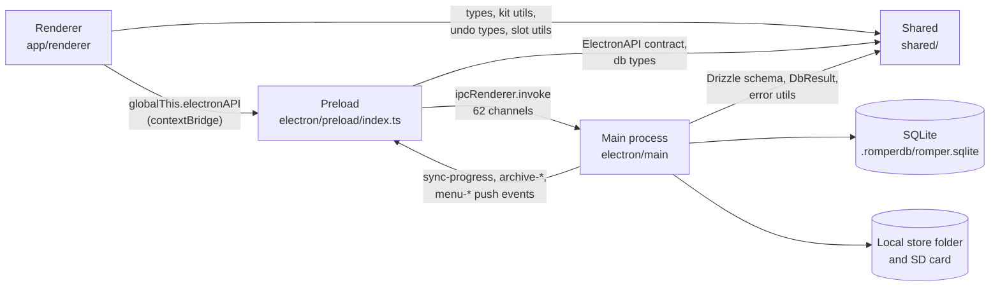

# Dependencies

> Reverse-engineered from `main` @ `87bea51` (app version 1.3.1) on 2026-09-29.
> `npm audit` and `npm outdated` were run the same day.

## Internal Dependencies

### Renderer depends on Preload
- **Type**: Runtime
- **Reason**: The renderer runs sandboxed with `contextIsolation: true` and
  `nodeIntegration: false`. All data and file access goes through the 65
  methods on `globalThis.electronAPI`, plus `electronFileAPI` and
  `romperEnv`. The contract is `shared/electronApi.ts`.

### Preload depends on Main
- **Type**: Runtime (IPC)
- **Reason**: Each bridge method is one `ipcRenderer.invoke` call. Main
  answers through `ipcMain.handle` in five handler files. Main pushes
  `sync-progress`, `archive-progress`, `archive-error` and the `menu-*`
  events back. The preload turns `menu-*` events into DOM `CustomEvent`s.

### Main, Preload and Renderer depend on Shared
- **Type**: Compile time (shared source, bundled into each layer)
- **Reason**:
  - `shared/db/schema.ts` - Drizzle tables, inferred types and `DbResult`.
    Used by main (34 files) and renderer (38 files).
  - `shared/electronApi.ts` - the bridge contract. Used by preload and
    renderer. **Main does not import it**, so handler signatures are not
    checked against the contract.
  - `shared/kitUtilsShared.ts` - kit-slot parsing, sorting and voice
    inference. Renderer (16 files) and `scanService`.
  - `shared/errorUtils.ts` - error classes and helpers. Both sides.
  - `shared/undoTypes.ts`, `shared/slotUtils.ts` - renderer only.
  - `shared/audioTypes.ts` - audio metadata types, through the contract.
  - `shared/db/index.ts` and `shared/db/tsconfig.json` - unused.

### Main-process service dependencies
- `syncService` depends on `syncSampleProcessing`, `syncFileOperations`
  (which uses `formatConverter` and `syncValidationService`),
  `syncMonoAnnotation`, `syncProgressManager` and `rtfFileService`.
- `sampleService` depends on `sampleCrudService`, `sampleBatchOperations`,
  `sampleMetadataService`, `sampleSlotService` and `sampleValidator`.
- `scanService` depends on the DB operations, `audioUtils` and
  `shared/kitUtilsShared`.
- `archiveService` depends on `archiveUtils` (`unzipper`, global `fetch`).
- All DB access goes through `db/romperDbCoreORM.ts`, a re-export file over
  `db/operations/*` and `db/utils/dbUtilities.ts`.
- `stereoSyncProcessor` and `rampleNamingService` exist but nothing in
  production calls them.

### Circular dependencies
`madge --circular` reports 4 cycles. All are type-only imports:
- `KitStepSequencer` and `StepSequencerGrid` / `useKitStepSequencerLogic`
- voice-panels `types` and `useVoicePanelSlotRendering`
- `syncFileOperations` and `syncProgressManager`

## External Dependencies

### Runtime (`dependencies`, 17 packages)

What actually ships: the main-process bundle leaves only `better-sqlite3`
and `unzipper` external. `drizzle-orm` and `update-electron-app`
are bundled into main, and the renderer bundle contains React and the
other UI libraries. Even so, Forge copies every package in `dependencies`
into the app, which is not packed into an asar archive. The production
closure is about 143 packages and 180 MB on disk, against roughly 14 MB
that the app needs at runtime (static estimate from the lockfile).

| Package | Version | Purpose | License | Status |
|---|---|---|---|---|
| react / react-dom | 19.2.4 | UI | MIT | In use (bundled) |
| react-router-dom | 7.18.2 | Routing | MIT | In use |
| react-window | 1.8.11 | Virtualised grid | MIT | In use; 2.x available |
| @phosphor-icons/react | 2.1.10 | Icons | MIT | In use; 33 MB on disk |
| better-sqlite3 | 12.10.0 | SQLite driver | MIT | In use (external, native); 13.x available |
| drizzle-orm | 0.45.2 | ORM and migrator | Apache-2.0 | In use (bundled) |
| unzipper | 0.12.3 | Zip extraction | MIT | In use (external) |
| update-electron-app | 3.2.0 | macOS auto-update | MIT | Bundled, but the bundle breaks it |
| drizzle-kit | 0.31.10 | Migration CLI | MIT | **Belongs in devDependencies** (73 MB) |
| @tailwindcss/vite | 4.3.1 | Vite plugin | MIT | **Belongs in devDependencies** |
| @vitejs/plugin-react | 6.0.2 | Vite plugin | MIT | **Belongs in devDependencies** |
| @typescript-eslint/eslint-plugin | 8.56.1 | Lint | MIT | **Unused**; the config uses the `typescript-eslint` package |
| lightningcss | 1.32.0 | CSS | MPL-2.0 | **Unused** directly (Tailwind already depends on it) |
| prebuildify | 6.0.1 | Native builds | MIT | **Unused** |
| react-dropzone | 14.4.1 | Drag and drop | MIT | **Unused**; drops are handled by hand |
| wavesurfer.js | 7.12.1 | Waveforms | BSD-3-Clause | **Unused**; waveforms are drawn on a canvas |

### Development (`devDependencies`, notable)

| Package | Version | Purpose | License |
|---|---|---|---|
| electron | 39.8.10 | Shipped runtime (out of support) | MIT |
| @electron-forge/cli, makers, plugin-fuses | 7.11.2 | Packaging | MIT |
| @electron/fuses | 1.8.0 | Fuse settings | MIT |
| @electron/rebuild | 4.0.3 | Native rebuild | MIT |
| typescript | 5.9.3 | Compiler | Apache-2.0 |
| vite | 8.0.16 | Build | MIT |
| vitest, @vitest/coverage-v8 | 4.1.11 | Unit and integration tests | MIT |
| @playwright/test, playwright | 1.58.2 | E2E tests and doc screenshots | Apache-2.0 |
| @testing-library/react, jest-dom, user-event | 16.3.2, 6.9.1, 14.6.1 | Component tests | MIT |
| jsdom | 26.1.0 | Test DOM | MIT |
| fast-check | 4.6.0 | Property-based tests | MIT |
| eslint, typescript-eslint | 9.39.3, 8.56.1 | Lint | MIT |
| eslint-plugin-sonarjs | 3.0.7 | Lint rules | LGPL-3.0-only |
| eslint-plugin-react-hooks, perfectionist, prettier | 5.2.0, 4.15.1, 5.5.5 | Lint rules | MIT |
| husky | 9.1.7 | Git hooks | MIT |
| concurrently | 9.2.1 | Parallel scripts | MIT |
| istanbul-merge, nyc | 2.0.0, 18.0.0 | Coverage merge | MIT, ISC |
| lcov | 1.16.0 | lcov merge tool | GPL-2.0-or-later |
| handlebars | 4.7.9 | Release-note templates | MIT |
| sharp, fontkit | 0.35.0, 2.0.4 | Icon and DMG background generators | Apache-2.0, MIT |
| archiver, tar, adm-zip | 7.0.1, 7.5.16, 0.6.0 | Test fixtures and archive tests | MIT, BlueOak-1.0.0, MIT |
| madge | 8.0.0 | Dependency analysis scripts | MIT |

**Unused devDependencies** (no import or script reference): `cross-env`,
`rollup` (Vite 8 uses Rolldown), `@fontsource-variable/inter` and
`@fontsource-variable/jetbrains-mono` (the fonts are vendored woff2 files),
`lint-staged` (configured but never run), `sonarqube-scanner` (CI uses the
GitHub action; it also pulls in a vulnerable `adm-zip`), `@types/tar`,
`@typescript-eslint/parser`, `@playwright/mcp`, `dependency-cruiser`.

**Phantom dependencies** (imported but not declared, so they only work
because npm hoists them): `chalk` (used by the release-notes script in the
release job), `fs-extra` (e2e tests), `glob`, `ws`, `@eslint/js`,
`prettier`, `tsx`.

### Licenses
All runtime packages are MIT, Apache-2.0 or BSD-3-Clause, except the unused
`lightningcss` (MPL-2.0). Copyleft licenses (LGPL-3.0, GPL-2.0) appear only
in development tools that are not shipped: `eslint-plugin-sonarjs`,
`sonarqube-scanner` and `lcov`. The fonts are OFL-1.1.

## Security Status

**`npm audit` (all packages): 45 advisories** - 1 critical, 30 high,
10 moderate, 4 low.

| Severity | Package | Where | Notes |
|---|---|---|---|
| Critical | tar 7.5.16 | dev | Parse DoS and others; fixed in 7.5.20+ |
| High | **electron 39.8.10** | **shipped runtime** | Four advisories (popup and sandbox inheritance, file/http protocol CORS, webview Node in workers). Fixed only in 41.10.6+, 42.3.4+ or 43+. |
| High (19) | @electron-forge chain, @electron/packager, extract-zip, tmp, appdmg | dev | All fixed by Forge 8 |
| High | adm-zip 0.6.0 | dev | Seven advisories |
| High | sharp 0.35.0 | dev | libheif; fixed in 0.35.4 |
| High | js-yaml, nanoid, brace-expansion | runtime and dev | ReDoS / DoS |
| Moderate | esbuild 0.18 (through drizzle-kit) | runtime | |
| Low | @babel/core, @inquirer/*, external-editor | dev | |

**`npm audit --omit=dev`: 7 advisories** (3 high, 4 moderate). Every one of
them arrives only through the build tools that are misplaced in
`dependencies` (drizzle-kit, @tailwindcss/vite and
@typescript-eslint/eslint-plugin). Moving those to devDependencies clears
the production audit. The Electron advisories do not show up here because
`electron` is a devDependency, but it is the shipped runtime.

**GitHub Dependabot**: 21 open alerts (15 high, 4 medium, 2 low). Security
updates are on, but there is no `.github/dependabot.yml`, so there are no
version updates and no GitHub Actions updates.

**`npm outdated`**: 30 packages are at least one major version behind.
Runtime: better-sqlite3 (12 to 13), react-window (1 to 2), and the unused
react-dropzone and wavesurfer.js. Development: electron (39 to 44), the
Forge packages (7 to 8), @electron/fuses (1 to 2), typescript (5.9 to 7.0),
vitest (4 to 5), eslint (9 to 10), jsdom (26 to 29) and others.
