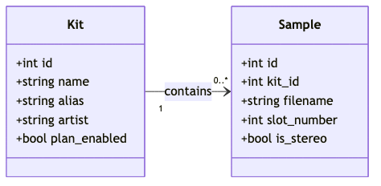

# Romper Database Schema

This document describes the schema for the Romper local SQLite database, which is created in the `.romperdb` folder inside the local store. The schema is implemented using **Drizzle ORM** for type safety and maintainability.

## Entity-Relationship Diagram (ERD)

- **kits**: Each kit is a collection of samples and has metadata fields, step sequencer patterns, and locking status.
- **voices**: Each kit has exactly 4 voices (voice numbers 1-4) with optional custom aliases.
- **samples**: Each sample belongs to a kit and voice, with WAV metadata including bitrate and sample rate.

## Table Definitions

### kits
- `id` INTEGER PRIMARY KEY AUTOINCREMENT
- `name` TEXT NOT NULL - Kit name/identifier
- `alias` TEXT - Optional display alias for the kit
- `artist` TEXT - Optional artist/creator information
- `editable` BOOLEAN NOT NULL DEFAULT 0 - Whether kit is enabled for sequencing plans
- `locked` BOOLEAN NOT NULL DEFAULT 0 - Whether kit is locked from editing
- `step_pattern` BLOB - Step sequencer pattern data (64 bytes: 16 steps × 4 voices, velocity 0-127 per step)

### voices
- `id` INTEGER PRIMARY KEY AUTOINCREMENT
- `kit_name` TEXT NOT NULL - Foreign key to kits.name
- `voice_number` INTEGER NOT NULL CHECK(voice_number BETWEEN 1 AND 4) - Voice number (1-4)
- `voice_alias` TEXT - Optional custom alias for this voice
- UNIQUE(kit_name, voice_number) - Each kit has exactly one record per voice number

### samples
- `id` INTEGER PRIMARY KEY AUTOINCREMENT
- `kit_name` TEXT NOT NULL - Foreign key to kits.name
- `voice_number` INTEGER NOT NULL CHECK(voice_number BETWEEN 1 AND 4) - Voice this sample belongs to
- `slot_number` INTEGER NOT NULL CHECK(slot_number BETWEEN 1 AND 12) - Slot position within the voice (1-12)
- `source_path` TEXT NOT NULL - Absolute path to original sample file for external references
- `filename` TEXT NOT NULL - Filename used on SD card
- `is_stereo` BOOLEAN NOT NULL DEFAULT 0 - Whether sample is stereo

## Data Constraints and Business Rules

### Kit Structure
- Each kit must have exactly 4 voice records (voice_number 1-4) created automatically upon kit insertion
- Step patterns stored as TEXT (JSON format) for XOX sequencer integration
- Editable mode controls whether kit can be modified (default: true for user kits, false for factory kits)

### Sample Organization
- Maximum 12 samples per voice (slots 1-12)
- Samples organized by voice (1-4) and slot (1-12) with explicit `voice_number` tracking
- Voice numbering in database is 1-indexed (1, 2, 3, 4)
- **Reference-only storage**: Samples stored via `source_path` field, not copied locally

### Sample Reference Architecture
- `source_path` contains absolute path to original sample file
- `filename` contains the name used when copying to SD card
- Files remain in original locations until SD card sync
- Missing `source_path` files detected and reported before sync operations

### WAV File Requirements
- Supported formats: 8-bit or 16-bit WAV files only
- Required sample rate: 44100 Hz (Rample hardware requirement)
- Supported channels: Mono or stereo
- Format conversion handled during SD card sync, not during editing

## Relationships
- kits (1) → voices (4) - Each kit has exactly 4 voices
- kits (1) → samples (many) - Each kit can have multiple samples
- voices (1) → samples (many) - Each voice can have up to 12 samples (slots)

## Scanning System Integration

The Romper scanning system automatically populates and updates database records with analyzed metadata:

### Voice Inference
- The voice inference scanner analyzes sample filenames to determine voice types
- Results are stored in the `voice_alias` field of the `voices` table
- Voice aliases are automatically capitalized (e.g., "kick" → "Kick", "hihat" → "HH")
- All 4 voice records are created for each kit, with unused voices having NULL aliases

### WAV Analysis
- WAV file analysis extracts technical audio properties during scanning
- `wav_bitrate` and `wav_sample_rate` fields are populated automatically
- `is_stereo` field is set based on channel analysis
- Analysis results help ensure Rample compatibility

### Database Operations
- Scanning operations use kit names (`kit_name`) as foreign keys
- Updates are performed using the `updateVoiceAlias()` function in romperDbCore
- All scanning operations maintain referential integrity with the kit-voice-sample relationship
- Batch operations ensure atomic updates across related records

For detailed information about the scanning system, see [Scanning System Documentation](./scanning-system.md).

---

_Last updated: 2025-06-23_

<!-- Schema and diagrams confirmed up to date with electron/main/db/romperDbCore.ts as of 2025-06-23 -->
