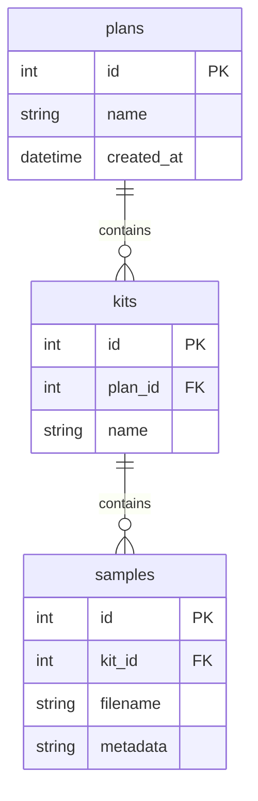

# Romper Database Schema

This document describes the schema for the Romper local SQLite database, which is created in the `.romperdb` folder inside the local store.

## Entity-Relationship Diagram (ERD)

- **plans**: Top-level plan objects.
- **kits**: Each kit belongs to a plan.
- **samples**: Each sample belongs to a kit.

## Table Definitions

### plans
- `id` INTEGER PRIMARY KEY AUTOINCREMENT
- `name` TEXT NOT NULL
- `created_at` DATETIME DEFAULT CURRENT_TIMESTAMP

### kits
- `id` INTEGER PRIMARY KEY AUTOINCREMENT
- `plan_id` INTEGER (FK to plans.id)
- `name` TEXT NOT NULL

### samples
- `id` INTEGER PRIMARY KEY AUTOINCREMENT
- `kit_id` INTEGER (FK to kits.id)
- `filename` TEXT NOT NULL
- `metadata` TEXT (JSON-encoded)

---

_Last updated: 2025-06-12_
