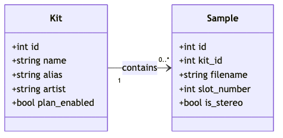

# Romper Database Schema

This document describes the schema for the Romper local SQLite database, which is created in the `.romperdb` folder inside the local store.

## Entity-Relationship Diagram (ERD)

- **kits**: Each kit is a collection of samples and has metadata fields.
- **samples**: Each sample belongs to a kit and has slot and stereo information.

## Table Definitions

### kits
- `id` INTEGER PRIMARY KEY AUTOINCREMENT
- `name` TEXT NOT NULL
- `alias` TEXT
- `artist` TEXT
- `plan_enabled` BOOLEAN DEFAULT 0

### samples
- `id` INTEGER PRIMARY KEY AUTOINCREMENT
- `kit_id` INTEGER (FK to kits.id)
- `filename` TEXT NOT NULL
- `slot_number` INTEGER
- `is_stereo` BOOLEAN DEFAULT 0

---

_Last updated: 2025-06-12_
